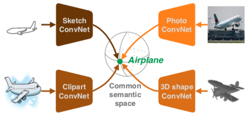
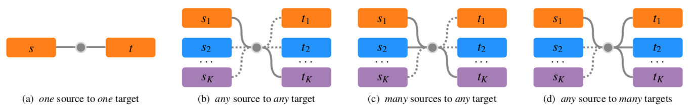

# open-search

This is the source code for reproducing the experiments from the paper:

[Open Cross-Domain Visual Search](https://arxiv.org/abs/1911.08621)
**William Thong, Pascal Mettes, Cees G.M. Snoek**
Computer Vision and Image Understanding (CVIU), *in press*, 2020

**TL;DR** *We search for seen and unseen categories from any source domain to any target domain.
To achieve this, we train domain-specific prototype-learner with a normalized temperature-scaled cross entropy loss to map inputs to a common semantic space.*



We validate the proposed approach on three well-established sketch-based tasks in a closed setting (a).
We propose three novel open cross-domain tasks to search for categories from and within any number of domains (b-d).



## Closed cross-domain experiments

### 1. Zero-shot sketch-based image retrieval

**Dataset**
To download the TU-Berlin and Sketchy datasets, check this [repository](https://github.com/qliu24/SAKE).

**Training**
Run [runs/closed-train-sbir.sh](runs/closed-train-sbir.sh). This will train one model for sketches and one model for images, for both datasets and for both normal zero-shot and generalized zero-shot settings.

**Evaluation**
Run [runs/closed-eval-sbir.sh](runs/closed-eval-sbir.sh). This will perform sketch-based image retrieval in both zero-shot and generalized zero-shot settings and measure the mAP@all and prec@100 metrics.

### 2. Few-shot sketch-based image classification

**Dataset**
Similar to the previous section, check this [repository](https://github.com/qliu24/SAKE) for downloading the Sketchy dataset.

**Training**
Run [runs/closed-train-sbic.sh](runs/closed-train-sbic.sh). This will train one model for sketches and one model for images.

**Evaluation**
Run [runs/closed-eval-sbic.sh](runs/closed-eval-sbic.sh). This will perform few-shot sketch-based image classification and measure the accuracy over 500 different runs.

### 3. Many-shot sketch-based 3D shape retrieval

**Dataset**
To prepare the [SHREC13](http://orca.st.usm.edu/~bli/sharp/sharp/contest/2013/SBR/),
[SHREC14](http://orca.st.usm.edu/~bli/sharp/sharp/contest/2014/SBR/) and Part-SHREC14 datasets, check this [repository](https://github.com/twuilliam/shrec-sketches-helpers).

**Training**
Run [runs/closed-train-sb3dr.sh](runs/closed-train-sb3dr.sh). This will train one model for sketches and one model for 2D projections of 3D shapes, for all three datasets.

**Evaluation**
Run [runs/closed-eval-sb3dr.sh](runs/closed-eval-sb3dr.sh). This will perform sketch-based 3D shape retrieval and measure the NN, FT, ST, E, DGC and mAP metrics.

## Open cross-domain experiments

**Dataset**
To prepare the [DomainNet](http://ai.bu.edu/M3SDA/) dataset, check this [repository](https://github.com/twuilliam/domainnet-helpers).

**Training**
Run [runs/open-train.sh](runs/open-train.sh). This will train one model for every domain in DomainNet, for zero-shot and many-shot settings (totalling 12 models).

**Features extraction**
Run [runs/open-eval.sh](runs/open-eval.sh). This will extract the features for every domain in both zero-shot and many-shot settings.

### 1. From *any* source to *any* target domains
Run [runs/open-eval.sh](runs/open-eval.sh). This will produce 36 cross-domain retrieval experiments and measure the mAP@all, for each setting.

### 2. From *many* source to *any* target domains
Run [runs/open-eval.sh](runs/open-eval.sh). This will combine several source domains to improve their initial mAP@all.

### 3. From *any* source to *many* target domains
Run [runs/open-eval.sh](runs/open-eval.sh). This will produce a search within multiple domains and measure the intent-aware mAP@100.

## Requirements

The code was initially implemented with python 2.7 and pytorch 0.3.1. I'll to migrate the source code to python 3.6 and pytorch 1.+ later. In the meantime, here is the configuration I used:

```
matplotlib=2.2.2
numpy=1.15.4
pandas=0.24.2
python=2.7.16
pytorch=0.3.1=py27_cuda8.0.61_cudnn7.1.2_3
faiss-gpu=1.5.3
torchvision=0.2.0=py27hfb27419_1
opencv=3.3.1
pretrainedmodels=0.7.4
```

## Citation

If you find these scripts useful, please consider citing our paper:

```
@article{
    Thong2020OpenSearch,
    title={Open Cross-Domain Visual Search},
    author={Thong, William and Mettes, Pascal and Snoek, Cees G.M.},
    journal={CVIU},
    year={2020},
    url={https://arxiv.org/abs/1911.08621}
}
```
